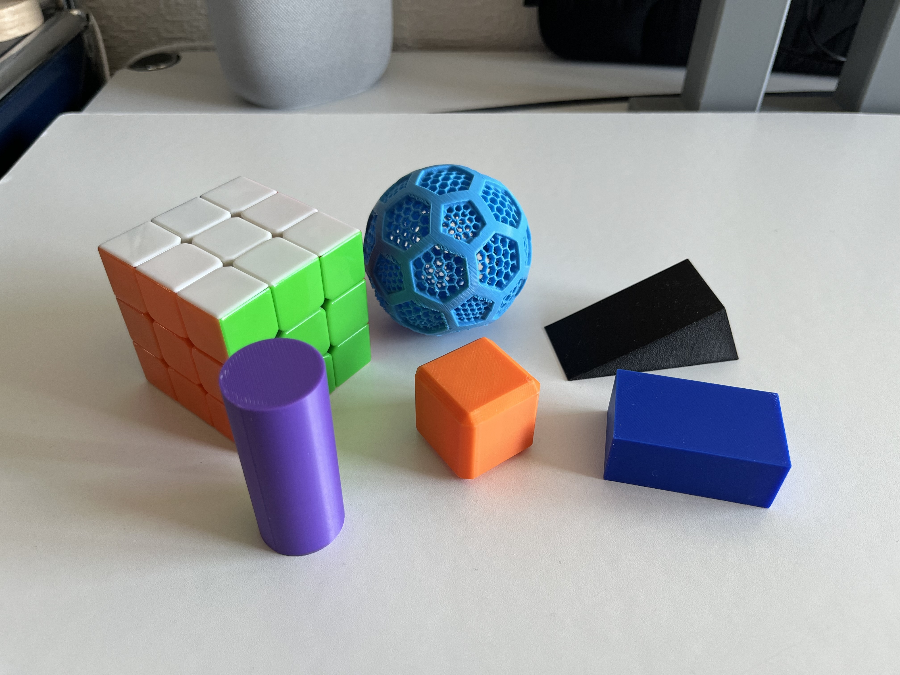
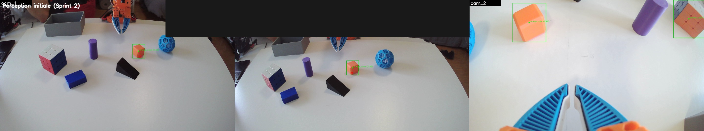
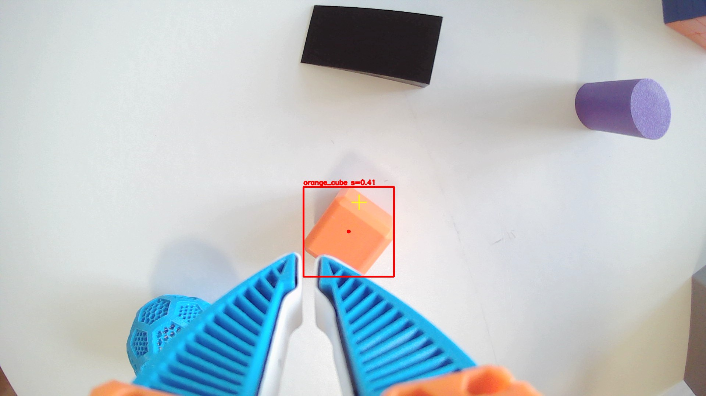
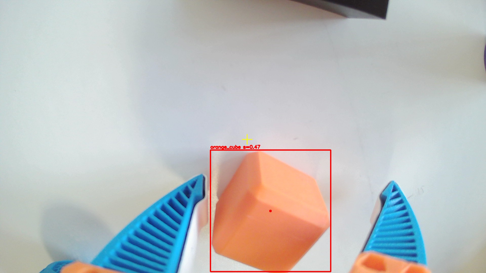

**Français** · [English](README.en.md)

# Saisie d'objets assistée par vision — SO-101

  

Ce dépôt regroupe le code que j'ai développé pour mon **travail de fin d'études
(TFE)** : une **pipeline modulaire complète de perception → planification → contrôle**,
« du pixel à la prise », qui fait **saisir des objets** à un bras robotisé SO-101,
bâtie au-dessus de [LeRobot](https://github.com/huggingface/lerobot).

Il ne remplace pas les ressources officielles. Pour **construire et câbler le robot**
(pièces, impression 3D, montage, téléopération de base), voir
[SO-ARM100](https://github.com/TheRobotStudio/SO-ARM100) et la
[documentation LeRobot SO-101](https://huggingface.co/docs/lerobot/so101). Ce dépôt
part du principe que l'on dispose **déjà d'un SO-101 fonctionnel et téléopérable**,
et met en œuvre par-dessus toute la chaîne « **voir → décider où saisir → exécuter** ».

| | |
|---|---|
| **Étudiant** | Maxence Chanier |
| **Encadrant** | Guido Bologna |
| **Cours** | Travail de fin d'études en informatique (Université de Genève) |
| **Année académique** | 2025-2026 |
| **Robot** | SO-101 — 6 servomoteurs Feetech STS3215 (5 articulations + pince), **sous-actionné à 5 DDL** |
| **Caméras** | 3 × USB 1920×1080 — `cam_0`/`cam_1` en stéréo *eye-to-hand* + `cam_2` *eye-in-hand* |
| **Machine** | MacBook Pro M4 (Apple Silicon, macOS) |

## Démonstration

Saisie du cube au milieu des autres objets par la **pipeline modulaire**
(perception stéréo → planification de l'angle de prise → descente et fermeture
asservie au couple) :


## Ce que fait ce projet

À partir de trois caméras et de l'état du robot, la chaîne localise un objet en 3D,
choisit un point et un angle de prise adaptés à sa géométrie, puis exécute la saisie
et la dépose — avec un recalage en boucle fermée juste avant de refermer la pince.

- Localisation 3D par **vision stéréo multi-caméras** (couleur HSV ou détecteur
  *open-vocabulary* Hugging Face).
- Choix **automatique du point et de l'angle de prise** selon la géométrie de
  l'objet et son accessibilité par le bras.
- **Recalage en boucle fermée** avec la caméra embarquée avant de refermer la
  pince, puis **saisie asservie au couple** (nouvel essai si la pince se ferme à vide).
- **Deux méthodes comparées** : pipeline modulaire et *imitation learning* (ACT) —
  voir [Deux approches](#deux-approches).

Le détail pas à pas de la chaîne est décrit dans
[Comment marche la saisie](#comment-marche-la-saisie).

## État et limites connues

Les objets testés (cube, cylindre, pavé, prisme triangulaire, balle, Rubik's Cube) :



La saisie est **fiable sur un objet isolé** de géométrie simple. Elle a été testée sur
plusieurs formes — cube, cylindre, pavé rectangulaire, prisme triangulaire, balle et
Rubik's Cube — saisies et déposées de façon répétée, souvent du premier coup (les
mesures chiffrées portent sur le cube et le cylindre ; le Rubik's Cube, multicolore,
n'est détecté qu'avec le détecteur *open-vocabulary* HF). Restent ouverts :

- les **scènes encombrées et l'occlusion** (sélection active de point de vue,
  évitement d'obstacles) — c'est la direction encore en cours ;
- la **robustesse de la perception sous éclairage variable** (calibration HSV à
  refaire selon les conditions).

## Installation

Prérequis : un SO-101 monté et téléopérable (voir liens en tête de page), Python
3.12, et les trois caméras branchées.

```bash
git clone https://github.com/machanier/tfe-lerobot-so101.git
cd tfe-lerobot-so101
./setup_env.sh          # crée le venv, clone + installe LeRobot, installe les dépendances
source venv/bin/activate
```

## Utilisation

```bash
source venv/bin/activate

# Vérifier toute la calibration (moteurs, caméras, hand-eye) + self-tests cinématiques
python scripts/check_calibration.py

# Téléopérer / prévisualiser une caméra
python scripts/teleoperate.py
python scripts/preview_camera.py --camera 0

# Perception seule : calibrer les couleurs (une fois, sous l'éclairage final) puis lancer
python scripts/calibrate_hsv.py
python scripts/run_perception.py                                  # live, 3 caméras
python scripts/run_perception.py --mode replay --replay <dataset>  # sans robot, sur données enregistrées

# Pick-and-place complet (perception → saisie → dépose)
python scripts/pick_and_place.py --target orange_cube --detector hsv
python scripts/pick_and_place.py --target orange_cube --detector hf   # détecteur open-vocabulary
```

Par défaut, `pick_and_place.py` enregistre des **snapshots de diagnostic** (vues des
caméras au moment de la prise) dans `outputs/perception/`. L'option `--display` ouvre
en plus une fenêtre de suivi en temps réel ; `--no-snapshots` coupe la sauvegarde.

## Comment marche la saisie

Les trois caméras au moment d'une prise — `cam_0`/`cam_1` en stéréo (détection et
position 3D de l'objet) et `cam_2` embarquée (vue rapprochée) :



La chaîne est orchestrée par [`src/pipeline.py`](src/pipeline.py) :

1. **Perception** — détection HSV (ou HF) dans `cam_0`/`cam_1`, triangulation stéréo
   de la position 3D (repère base, `z = 0` sur la plaque). Un biais de calibration
   mesuré est soustrait ([`configs/perception/bias_correction.json`](configs/perception/bias_correction.json)).
2. **Planification** ([`src/planning/grasp.py`](src/planning/grasp.py)) — angles
   candidats top-down / diagonale / face avant proposés selon la zone, on garde le
   premier atteignable par l'IK ; approche alignée sur le grand axe pour un objet
   allongé.
3. **Raffinement `cam_2`** ([`src/control/closed_loop.py`](src/control/closed_loop.py))
   — à quelques cm au-dessus de l'objet, la caméra *eye-in-hand* corrige la position
   et réaligne les mâchoires, sous garde-fous (taille du blob, plafond de correction).
4. **Offsets de prise** — le repère outil commandé n'est pas le point où les mâchoires
   serrent (le mécanisme est monté à côté de l'axe du poignet) ; deux offsets
   horizontaux (latéral adaptatif = ½ largeur + marge ; profondeur) amènent les doigts
   au bon endroit.
5. **Saisie** — descente, fermeture asservie au couple, vérification après la levée,
   nouvel essai si fermeture à vide, puis dépose.

Le raffinement `cam_2` en action — la caméra embarquée recadre l'objet et réaligne
les mâchoires juste avant la descente :

<p align="center">
  
  
</p>

## Deux approches

Le projet compare deux façons de résoudre la même tâche :

- **Pipeline modulaire** *(cœur de `src/`)* — perception explicite, planification
  géométrique par règles, cinématique inverse, boucle fermée. Interprétable et sans
  données d'entraînement.
- **Imitation learning (ACT)** — la saisie est apprise à partir de démonstrations
  téléopérées, via la stack officielle LeRobot (`LeRobotDataset` + policy ACT).
  Procédure détaillée dans [`docs/IL_ACT_RUNBOOK.md`](docs/IL_ACT_RUNBOOK.md) et,
  pour l'entraînement sur GPU cloud, [`docs/IL_COLAB.md`](docs/IL_COLAB.md).


Datasets et modèles entraînés, publics sur le Hugging Face Hub :
- Dataset : [`Machanier/so101_orange_cube`](https://huggingface.co/datasets/Machanier/so101_orange_cube)
  (variante basse résolution : [`_lowres`](https://huggingface.co/datasets/Machanier/so101_orange_cube_lowres))
- Modèle ACT : [`Machanier/act_so101_orange_cube`](https://huggingface.co/Machanier/act_so101_orange_cube)
  (variante basse résolution : [`_lowres`](https://huggingface.co/Machanier/act_so101_orange_cube_lowres))

## Résultats

Campagne d'évaluation du pick-and-place (taux de réussite, intervalle de confiance
Wilson 95 %). Données brutes dans [`results/`](results/), analyse détaillée dans le mémoire.

| Objet | Pipeline — HF | Pipeline — HSV | Imitation (ACT) |
|---|---|---|---|
| Cube *(30 essais/détecteur)* | **77 %** | 67 % | 70 % |
| Cylindre *(9 essais/détecteur)* | **78 %** | 67 % | 0/5 *(sonde de généralisation)* |

Les deux approches sont **à égalité sur le cube** (intervalles de confiance qui se
recouvrent) ; le départage se fait sur la **généralisation**, où la pipeline garde
l'avantage (cylindre, objets désignés par le langage) tandis que la politique apprise
reste sur sa distribution d'entraînement.

## Structure du dépôt

```
tfe-lerobot-so101/
├── src/                  # la pipeline perception → planification → contrôle
│   ├── perception/       # détection 2D + reconstruction 3D (stéréo, PnP)
│   ├── planning/         # sélection du point et de l'angle de prise (adaptatif)
│   ├── control/          # IK 5-DOF, trajectoires, boucle fermée cam_2, moteurs
│   ├── calibration/      # hand-eye, cinématique directe, moteurs → angles
│   ├── utils/            # helpers SE(3)
│   └── pipeline.py       # orchestration de bout en bout
├── scripts/              # CLI : calibration, perception, pick-and-place, IL (train/éval)
├── configs/              # calibrations de mon setup + modèle URDF du robot
├── tests/                # tests d'intégration synthétiques + sélection de prise
├── hardware/             # modèles 3D imprimés (structure, boîte, pince, objets)
├── results/              # CSV des campagnes (saisie pipeline & IL, structure, éclairage)
├── docs/                 # repère base, runbook IL, mémoire (PDF + source LaTeX), médias
├── requirements.txt · setup_env.sh
└── LICENSE
```

Repère de base et procédure de mesure : [`docs/REPERE_BASE.md`](docs/REPERE_BASE.md).

## Mémoire

Ce dépôt accompagne mon mémoire de TFE, qui détaille la démarche, les choix de
conception et l'évaluation :
**[Mémoire — PDF](docs/memoire/Memoire_Bachelor_Chanier_Maxence.pdf)**.

Le **cahier des charges** (sujet et objectifs officiels du TFE) :
[docs/cahier_des_charges.pdf](docs/cahier_des_charges.pdf).

## Ressources

- [LeRobot](https://github.com/huggingface/lerobot) — stack Hugging Face
  (téléopération, datasets, policies) sur laquelle ce projet s'appuie.
- [Documentation LeRobot SO-101](https://huggingface.co/docs/lerobot/so101)
- [SO-ARM100](https://github.com/TheRobotStudio/SO-ARM100) — dépôt matériel
  officiel du bras (source de l'URDF).

## Comment citer

```bibtex
@mastersthesis{chanier2026saisie,
  author = {Chanier, Maxence},
  title  = {Saisie d'objets en environnement pour un bras robotique assisté par vision},
  school = {Université de Genève, Faculté des sciences},
  year   = {2026},
  type   = {Travail de fin d'études}
}
```

## Assistance au développement

Le code et la documentation ont été élaborés avec l'aide d'un assistant IA
(**Claude**, via Claude Code). La conception, les choix techniques, la mise au
point sur le robot et l'ensemble des décisions relèvent de l'auteur.

## Licence

Code distribué sous licence **MIT** — voir [LICENSE](LICENSE).
